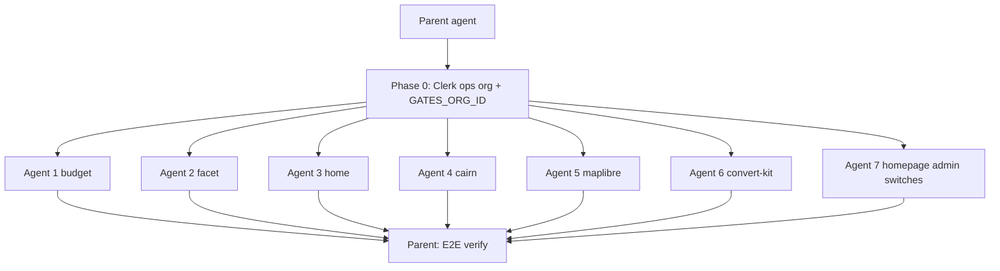

# Fleet gates plan

## Goal

From **https://uptonm.dev/admin**, six **switches** (one per personal site). On = that site requires Clerk login; off = public.

- **UI:** `/admin` on the homepage only (never the Clerk dashboard for day-to-day).
- **Storage:** Clerk Organization `publicMetadata` (no database).
- **Auth:** one shared Clerk production app (custom domain on `uptonm.dev`), so sessions work across `*.uptonm.dev`.

## Scope

### Control plane (7th agent — toggles UI, not a gated target)

| Project | Domain | Role |
|---------|--------|------|
| `portfolio` / `uptonm.dev` | `uptonm.dev` | Hosts `/admin` switches; writes gate metadata |

### Six gated satellites (agents 1–6)

| # | Vercel project | Domain | `GATES_APP_ID` | Local repo | Icon source (`icon-512.png`) |
|---|----------------|--------|----------------|------------|------------------------------|
| 1 | `budget` | `budget.uptonm.dev` | `budget` | `~/Projects/budget` | `public/icon-512.png` |
| 2 | `facet` | `facet.uptonm.dev` | `facet` | `~/Projects/facet` | `public/icon-512.png` |
| 3 | `home` | `home.uptonm.dev` | `home` | `~/Projects/home` | live `https://home.uptonm.dev/icon-512.png` (not in local tree; copy into portfolio) |
| 4 | `cairn` | `cairn.uptonm.dev` | `cairn` | `~/Projects/cairn` | `apps/site/public/icon-512.png` |
| 5 | `maplibre-gl-style-editor` | `map.uptonm.dev` | `maplibre-gl-style-editor` | `~/Projects/maplibre-gl-style-editor` | `public/icon-512.png` |
| 6 | `convert-kit` | `convert.uptonm.dev` | `convert-kit` | `~/Projects/convert-kit` | `public/icon-512.png` |

**Out of scope:** `eleos`, `atlas` / `atlas-ui`, local-only tooling.

## Data model

Singleton org on the **production** Clerk instance:

- Slug: `ops`
- `publicMetadata`:

```json
{
  "gates": {
    "budget": false,
    "facet": false,
    "home": false,
    "cairn": false,
    "maplibre-gl-style-editor": false,
    "convert-kit": false
  }
}
```

- `true` = locked  
- `false` / missing = public  

**v1:** enforce gates only when `VERCEL_ENV === 'production'`. Preview/local stay public.

## Free tier constraints (Clerk Hobby + Vercel Hobby)

- **OK on Hobby:** custom domain, basic Organizations + metadata (no $100 B2B add-on), one Clerk app across many Vercel projects, subdomain session sharing on `*.uptonm.dev`.
- **Not required / avoid:** Clerk **Satellite Domains** (paid; only for different *root* domains). Stay on `*.uptonm.dev`.
- **Sessions:** Hobby fixes session lifetime at 7 days; no simultaneous sessions — accepted.
- **Gate reads:** do not bare-call BAPI on every middleware hit. Use `fetch`/`unstable_cache` with `revalidate: 60`, or read a portfolio `/api/gates` response cached ~60s (prod BAPI limit is 1000/10s — personal traffic is fine if cached).
- **Security:** set subdomain allowlist + `authorizedParties` for the six hosts + `uptonm.dev`.

---

## Execution model: parent + 7 parallel subagents



### Parent (before fan-out)

1. **Phase 0 only** — enable orgs, create `ops`, seed all six gate keys `false`, record `GATES_ORG_ID`, batch-allow the six origins (+ portfolio), set `GATES_ORG_ID` on Vercel `portfolio` Production + redeploy portfolio so runtime can write metadata.
2. Spawn **seven** parallel `generalPurpose` subagents with shared `GATES_ORG_ID` and the recipe below.
3. Collect results, fix cross-cutting issues, E2E one toggle (budget).

Parent does **not** build the admin switch UI — that’s agent 7.

### Agents 1–6 — satellites (parallel, isolated)

Given: repo path, Vercel project, domain, `GATES_APP_ID`, `GATES_ORG_ID`.

Must:

1. Add `@clerk/nextjs` if missing.
2. `ClerkProvider` + middleware/proxy: production-only gate read → `auth.protect()` when locked.
3. `NEXT_PUBLIC_CLERK_SIGN_IN_URL=https://uptonm.dev/sign-in`.
4. Vercel env matrix (live/test split); never print secrets.
5. Commit on a branch in **that** repo only (no push/PR unless asked).
6. Return: branch, files, env names set, blockers.

Must **not** touch portfolio or other satellites.

### Agent 7 — homepage / portfolio admin UI

Repo: `~/Projects/uptonm.dev` only.

Must:

1. **`lib/gates.ts`** — `getGates()`, `setGate(appId, locked)` via `clerkClient.organizations.*` using `GATES_ORG_ID`.
2. **`GATED_APPS` registry** — six entries: `id`, `label`, `url`, `iconSrc` (local path under portfolio public).
3. **Vendor icons** into e.g. `apps/portfolio/public/gates/{id}.png`:
   - Copy each satellite’s `icon-512.png` (see table).
   - For `home`, fetch/save from `https://home.uptonm.dev/icon-512.png` if not in the local repo.
4. **Admin UI row design** (not bare checkboxes):
   - One row per app.
   - **Left:** app icon — the 512×512 asset, displayed small (≈24–32px) via `next/image` (`width`/`height` or CSS), rounded slightly to match site chrome.
   - **Label** (name + optional domain).
   - **Right:** a **Switch** (on = private/locked, off = public). Add a Switch primitive to `@uptonm/ui` (Radix) if missing — portfolio UI package has no Switch today.
5. Server action: `requireAdmin()` → `setGate` → revalidate; switch calls it.
6. `turbo.json` `build.env`: include `GATES_ORG_ID` (and any new public vars if added).
7. Confirm `GATES_ORG_ID` already on Vercel Production (parent); redeploy if agent 7 adds more env.
8. Commit on `uptonm.dev` branch; return summary.

Must **not** implement satellite middleware (agents 1–6).

#### Admin row wireframe

```text
┌─────────────────────────────────────────────┐
│  [icon]  Budget          budget.uptonm.dev  ○──● │
│  [icon]  Facet           facet.uptonm.dev   ●──○ │
│  …                                              │
└─────────────────────────────────────────────┘
  512→~28px                Switch: on = gated
```

Accessibility: switch has `aria-label` like “Require login for Budget”; icon is decorative (`alt=""`) or `alt` = app name if no visible text.

---

## Phase 0 — Clerk one-time (parent)

1. `clerk enable orgs` on production instance.
2. Create org `ops`, seed `gates` with all six keys `false`.
3. Ensure admin user is a member; sign-up disabled.
4. Save `GATES_ORG_ID`.
5. Allow origins/redirects for all six domains + `https://uptonm.dev`.
6. `vercel env add GATES_ORG_ID production` on `portfolio` + **redeploy**.

---

## Satellite recipe (agents 1–6)

### Middleware

```ts
if (process.env.VERCEL_ENV !== 'production') return
if (!(await isAppGated(process.env.GATES_APP_ID!))) return
await auth.protect()
```

`isAppGated`: `getOrganization(GATES_ORG_ID)` → `gates[appId]`, cache 30–60s.

### Vercel env matrix

| Name | Production | Preview | Development |
|------|------------|---------|-------------|
| `NEXT_PUBLIC_CLERK_PUBLISHABLE_KEY` | `pk_live` | `pk_test` | `pk_test` |
| `CLERK_SECRET_KEY` | `sk_live` | `sk_test` | `sk_test` (no `--sensitive`) |
| `NEXT_PUBLIC_CLERK_SIGN_IN_URL` | `https://uptonm.dev/sign-in` | same | same |
| `NEXT_PUBLIC_CLERK_SIGN_UP_URL` | `https://uptonm.dev/sign-up` | same | same |
| `GATES_ORG_ID` | prod org id | omit | omit |
| `GATES_APP_ID` | per table | same | same |

### Redeploy

| Change | Action |
|--------|--------|
| Code merge | Git deploy |
| `NEXT_PUBLIC_*` | Rebuild / Redeploy |
| `CLERK_SECRET_KEY` / `GATES_*` | Redeploy |
| Switch flip on `/admin` | None (≤ cache TTL) |

### App-specific

- **cairn:** gate `apps/site` (or whatever serves `cairn.uptonm.dev`), not Rust/CLI.
- **home:** Vercel Next for `home.uptonm.dev`.
- **maplibre:** host `map.uptonm.dev`.
- **convert-kit:** host `convert.uptonm.dev`.

---

## Runtime

```text
Anonymous → budget.uptonm.dev
  production + gates.budget → sign-in on uptonm.dev → back with session

You → /admin → Switch on → PATCH metadata → ~45s later site locks
```

---

## Verification (parent, after all 7 return)

- [ ] `/admin` shows six rows: 512 icon (scaled) + Switch.
- [ ] Toggling updates org metadata.
- [ ] Each Production domain public when off.
- [ ] Budget E2E: on → lock → sign-in → access; off → public.
- [ ] Previews stay public.
- [ ] No redeploy needed for subsequent switches.

## Non-goals (v1)

- No DB / Vercel KV.
- No gate enforce on Preview/Development.
- No per-app Clerk applications.
- No day-to-day Clerk Dashboard toggles.
