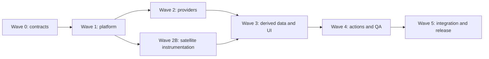

# Fleet metrics expansion plan

Extends the `/admin` fleet dashboard from per-site GitHub/Vercel counters into a
small operations console. `/admin` remains the fast fleet overview; each app
gets a focused detail page. Provider collection moves out of page rendering and
into durable, scheduled observations.

## Target structure

```text
/admin
├── Overview: attention queue, fleet summary, compact app cards
├── /attention
├── /apps/[appId]
│   ├── Delivery
│   ├── Experience
│   ├── Configuration
│   ├── Operations
│   └── Activity
├── /activity
└── /settings
```

This avoids extending the already-large `apps/portfolio/src/lib/fleet-metrics.ts`
and `apps/portfolio/src/components/FleetGates.tsx` monoliths.

## Complete scope

| Area | Information to add | Source |
|---|---|---|
| Needs attention | Severity, affected app, reason, first/last seen, source link, acknowledge/snooze | Deterministic rules across every observation |
| Production drift | Default-branch SHA versus production SHA, ahead/behind count, unshipped commits, deployed branch and age | GitHub compare + Vercel deployment metadata |
| Deployment health | 7/30-day success rate, deployment frequency, active builds, build duration, lead time, latest failure, previous known-good deployment | Vercel deployments |
| PR quality | Oldest/stale PRs, draft status, requested reviews, review decision, mergeability/conflicts, failing/pending checks | GitHub Pull Requests and checks |
| Branch hygiene | Active, stale, fully merged and unknown branches; last commit and ahead/behind counts | GitHub branches + compare |
| Runtime health | External uptime, latency, request volume, 5xx rate, function failures, p50/p95 duration and incident history | Vercel metrics + independent HTTP probes |
| Traffic | Page views, visitors, top routes/referrers, bandwidth and previous-period changes | Vercel Web Analytics and request metrics |
| Performance | P75 LCP, INP, CLS and TTFB, sample count, route/device breakdown, regressions, Lighthouse and bundle budgets | Speed Insights + synthetic build reports |
| Security | Dependabot counts/severity, secret and code-scanning counts, branch/ruleset protection, optional deployment protection | GitHub security APIs + Vercel configuration |
| Domains | Expected domains, verification, DNS target, certificate expiry/SAN, HTTPS and canonical redirect status | Vercel domains + DNS/TLS/HTTP probes |
| Environment health | Missing, extra or incorrectly targeted environment variable names | Vercel environment metadata + expected manifest |
| Costs and limits | Current/prior-period costs, forecast, budget percentage, cost contributors and known limits | Vercel billing charges and policy configuration |
| Maintenance | Dependency freshness, framework/runtime versions, release age, repository activity and upgrade PRs | Safe manifest reads + package registries + GitHub |
| Scheduled jobs | Schedule, next expected run, last outcome/duration, missed/overlapping runs and failure streak | Declared cron configuration + heartbeat ingestion |
| Audit history | Gate changes, refreshes, acknowledgements and provider actions, including actor, result and redacted before/after state | Local append-only audit log |

GitHub provides the required pull request, branch, commit comparison, Dependabot
and secret-scanning surfaces. Vercel provides deployment/domain/environment
operations through its REST API, alongside Web Analytics querying, Speed Insights
metrics and billing charges.

"Open branches" is presented as active, stale, merged or unknown because Git
branches do not technically have an open/closed state.

## Foundation

Before feature agents fan out, the integrator freezes these shared contracts.

### Observation contract

```ts
type Observation<T> = {
  status:
    | "ok"
    | "partial"
    | "stale"
    | "unsupported"
    | "unconfigured"
    | "error";
  data: T | null;
  observedAt: string | null;
  staleAt: string | null;
  source: string;
  sourceUrl?: string;
  error?: {
    code: string;
    message: string;
  };
};
```

Missing permissions, disabled products and errors must never appear as healthy
zeroes.

### Persistent data

Use managed Postgres with Drizzle. Suggested tables:

- `collection_runs`
- `observations`
- `metric_rollups`
- `deployments`
- `health_checks`
- `attention_items`
- `attention_state`
- `incidents`
- `cron_runs`
- `audit_events`
- `action_requests`

Raw high-frequency samples retained for 30 days, hourly/daily rollups for roughly
13 months, and audit/incidents considerably longer.

### Satellite manifest

Each application repository gets a `.fleet/manifest.json` containing:

- Stable app ID and canonical URL
- Expected domains and redirects
- Health-check path
- Expected environment variable names and target scopes
- Cron schedules
- Framework/runtime and performance budgets
- Supported dashboard capabilities

It must never contain secret values.

### Collection model

The admin interface reads last-known observations from the database. It does not
wait for GitHub or Vercel during page rendering.

- Every 2–5 minutes: CI, deployments, drift, runtime probes
- Every 10–15 minutes: PRs, branches, traffic, performance
- Every 1–6 hours: security, domains, environment, maintenance, costs
- Manual refresh: targeted by app and category
- Later optimization: GitHub and Vercel webhooks

Vercel does not retry failed cron invocations, so scheduled-job reporting needs
an explicit heartbeat rather than assuming "no log means success."

## Parallel execution plan

With four available agent slots, the integrator can run three independent packets
at a time.



### Wave 0 — Integrator-only contract freeze

- Define observation schemas and capability/error states.
- Define database schema and retention.
- Define `.fleet/manifest.json`.
- Define thresholds and viewer/operator/admin permissions.
- Probe the intended tokens against every endpoint.
- Add dependencies and test infrastructure once.
- Move the fleet registry into a typed, server-only module.

Acceptance: every feature can represent supported, unsupported, permission-denied,
stale and failed states.

### Wave 1 — Platform foundation

These packets are independent after Wave 0.

| Packet | Agent ownership | Deliverable |
|---|---|---|
| `F1-PERSISTENCE` | Database agent | Schema, migrations, repositories, retention and rollups |
| `F2-COLLECTOR` | Collection agent | Provider client base, timeouts, rate handling, locks, cache tags and last-known-good behavior |
| `F3-TESTS` | Test agent | Vitest/Playwright setup, sanitized fixtures, provider mocks and factories |
| `F4-ADMIN-SHELL` | UI agent | Admin routes, navigation, loading/error states and responsive shells using fixtures |
| `F5-AUTH-AUDIT` | Security agent | Viewer/operator/admin authorization, audit primitives and idempotent action requests |

Run `F1–F3`, then `F4–F5` while the integrator reviews the first batch.

### Wave 2 — Provider lanes

| Packet | Scope |
|---|---|
| `GITHUB-DELIVERY` | PR quality, branch classification, CI normalization, drift comparison, releases and repository activity |
| `GITHUB-SECURITY` | Dependabot, secret/code scanning, branch protection and dependency/runtime freshness |
| `VERCEL-DEPLOYMENTS` | Deployment history, success rates, build/lead times, active builds, production SHA and rollback candidates |
| `VERCEL-METRICS` | Team-wide runtime, traffic and Speed Insights queries grouped by project |
| `VERCEL-CONFIG` | Domains, certificates, environment metadata, billing charges and limits |
| `OPERATIONS-PROBES` | External HTTP/DNS/TLS checks, incident generation and cron heartbeat ingestion |

Agents own only their provider directory, fixtures and tests. They do not edit
shared contracts, routes, package files or the fleet registry.

For security collection:

- Use a read-only fine-grained GitHub PAT limited to the six repositories.
- Request only the necessary repository permissions.
- Secret scanning must request hidden/redacted secret data and retain only
  aggregates and provider links.
- Environment collection compares names, scopes and types only—never decrypted
  values.

### Wave 2B — Satellite instrumentation

Create one packet per repository:

- `SAT-BUDGET`
- `SAT-FACET`
- `SAT-HOME`
- `SAT-CAIRN`
- `SAT-MAP`
- `SAT-CONVERT`

Run these in two batches of three. Each agent:

- Adds and validates `.fleet/manifest.json`.
- Verifies Web Analytics and Speed Insights instrumentation.
- Adds an allowlisted health endpoint where appropriate.
- Produces a build report containing framework/runtime and bundle size.
- Wraps existing scheduled jobs with heartbeat reporting.
- Reports required environment variable names without values.

The live capability audit found request metrics for all six applications, Web
Analytics data for Budget and Map, and Speed Insights data for Budget. The
remaining repositories therefore need explicit instrumentation verification.

### Wave 3 — Derived information and UI

| Packet | Scope |
|---|---|
| `DERIVED-HEALTH` | Rollups, thresholds, attention rules, deduplication and incident lifecycle |
| `UI-OVERVIEW` | Attention feed, fleet summary and compact app cards |
| `UI-DELIVERY` | Drift, PRs, branches, CI and deployment details |
| `UI-EXPERIENCE` | Runtime, traffic, performance and accessible charts |
| `UI-OPERATIONS` | Security, domains, environment, cost, maintenance and scheduled jobs |
| `UI-ACTIVITY` | Incidents, audit history, freshness/error primitives |

UI agents work against frozen fixtures. The integrator alone wires route entry
points and live data.

Suggested configurable defaults:

- Stale PR: 14 days
- Stale branch: 30 days
- TLS warning/critical: 21/7 days
- Telemetry stale: twice its expected collection interval
- Error-rate alert: only after a minimum sample, such as 100 requests
- Cost warning: 80% of budget
- Missed cron: expected time plus configurable grace
- Uptime incident: two consecutive external failures

### Wave 4 — Safe actions and quality

| Packet | Scope |
|---|---|
| `ACTION-SERVER` | Typed Vercel action executor, idempotency, authorization and audit |
| `ACTION-UI` | Confirmation sheets and mutation status client islands |
| `QUALITY` | Unit, contract, integration, E2E, accessibility, visual and chaos tests |
| `INTERNAL-OBS` | Redacted structured telemetry for collector and action failures |

Initial actions:

- Open GitHub/Vercel logs
- Targeted refresh
- Acknowledge/snooze attention
- Redeploy
- Cancel an active deployment
- Roll back to a known-good deployment

Production rollback requires typed project confirmation and recent authentication.
Every mutation must write an audit record and then trigger targeted revalidation.
Before this wave, `apps/portfolio/src/lib/admin.ts` must be strengthened because
its current guard treats any signed-in user as an administrator.

### Wave 5 — Integrator and release

- Assemble routes and provider queries.
- Migrate the database.
- Deploy a read-only preview.
- Seed/backfill available deployment and metric history.
- Run a 24-hour collection soak.
- Enable operational actions behind a separate feature flag.
- Perform production smoke testing.
- Remove the old monolith only after parity is confirmed.

## Mobile requirements

- Attention appears before fleet cards.
- App cards show only privacy, production, CI, runtime, traffic trend, performance
  and attention count.
- Details move to app pages rather than expanding indefinitely inside cards.
- App sections stack vertically; no horizontally clipped tabs or tables.
- Controls have at least 44px touch targets.
- Charts include a text summary and accessible data table.
- Verify 320px, 375px, 200% zoom and long provider/error strings.
- Freshness and error text must wrap; no destructive truncation of important
  status information.

## Merge and testing gates

1. **Contract gate:** schemas, capability states, roles and fixtures frozen.
2. **Provider gate:** pagination, rate limits, partial results and
   401/403/404/429/timeouts tested.
3. **Data gate:** retention, incident lifecycle, attention deduplication and
   append-only audit verified.
4. **UI gate:** loading, empty, stale, unsupported and error states; mobile and
   accessibility verified.
5. **Mutation gate:** authorization, confirmation, idempotency and auditing
   verified against test resources.
6. **Release gate:** read-only canary, monitoring, rollback procedure and
   token-scope review.

Parallel agents work from the same phase baseline with exclusive directory
ownership. Only the integrator changes shared contracts, registry files, route
entry points, package manifests and lockfiles.
